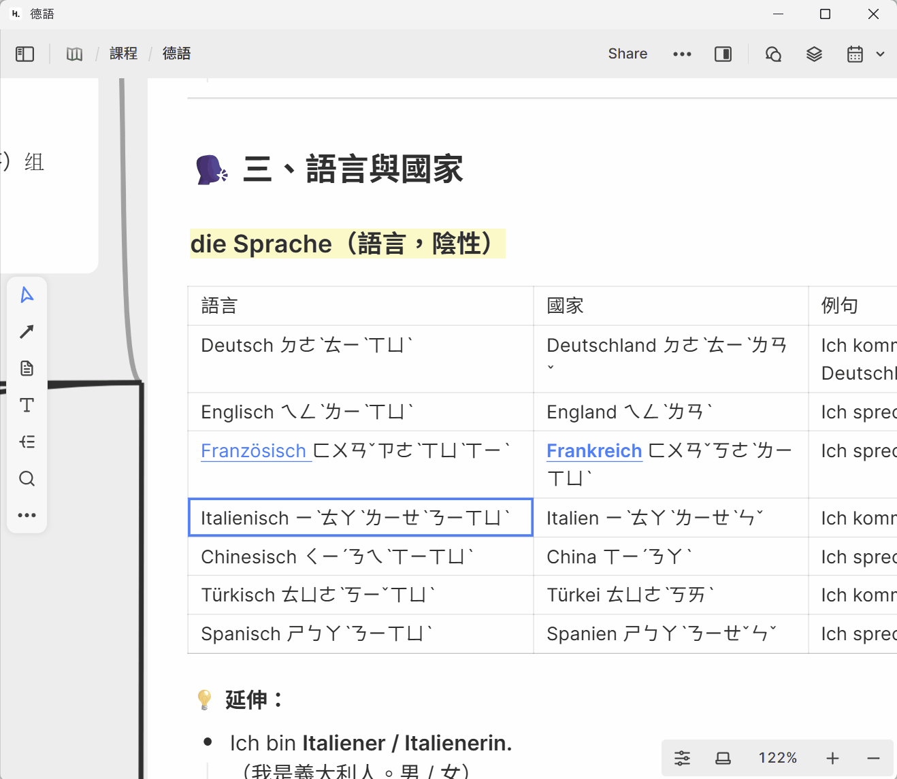
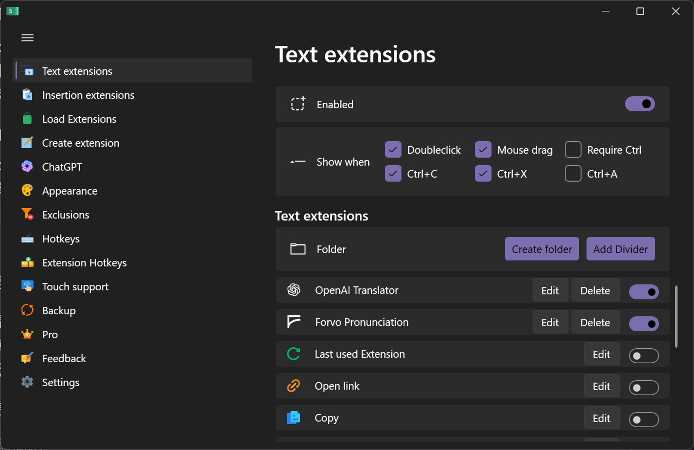

# Forvo Pronunciation Lookup - SnipDo Extension

[中文版本](#中文版本) | [English Version](#english-version)

---

## English Version

A SnipDo extension that allows you to quickly look up word pronunciations on Forvo.com by selecting text.



### Features

- 🎯 Select any word and instantly open its Forvo pronunciation page
- 🌍 Customizable page language and pronunciation language
- ⚡ Fast and lightweight
- 🔧 Easy to configure via SnipDo settings

### Installation

1. Download `forvo-pronunciation.pbar` from the [Releases](../../releases) page
2. Open SnipDo
3. Import the `.pbar` file into SnipDo
4. The extension is ready to use!

### Usage

1. Select any word (e.g., "Frankreich")
2. Open SnipDo menu (default: right-click or hotkey)
3. Click the "Forvo Pronunciation" icon
4. Your browser will open the Forvo page with pronunciation (e.g., `https://zh.forvo.com/word/frankreich/#de`)

### Customization

You can customize the page language and pronunciation language in SnipDo settings:



1. Open SnipDo settings
2. Find "Forvo Pronunciation" extension
3. Edit the PowerShell script
4. Modify these two parameters at the top of the script:

```powershell
# Page Language (interface language)
$PAGE_LANG = "zh"  # Change to "en", "ja", "ko", "fr", "de", etc.

# Pronunciation Language (audio language)
$PRONUNCIATION_LANG = "de"  # Change to "en", "fr", "es", "ja", etc.
```

#### Common Language Codes

| Language | Code |
|----------|------|
| German | `de` |
| English | `en` |
| French | `fr` |
| Spanish | `es` |
| Japanese | `ja` |
| Chinese | `zh` |
| Korean | `ko` |
| Russian | `ru` |
| Italian | `it` |
| Portuguese | `pt` |

### Requirements

- Windows OS
- [SnipDo](https://snipdo.com/) installed
- PowerShell (built-in on Windows)

### Technical Details

- Extension format: `.pbar` (zip archive)
- Script language: PowerShell
- Forvo URL pattern: `https://{PAGE_LANG}.forvo.com/word/{word}/#{PRONUNCIATION_LANG}`

### Build from Source

If you want to modify and rebuild the extension:

```powershell
# Navigate to the extension directory
cd forvo-pronunciation

# Package the extension
Compress-Archive -Path icon.png,forvo-pronunciation.json,forvo-pronunciation.ps1 -DestinationPath forvo-pronunciation.zip -Force

# Rename to .pbar
mv forvo-pronunciation.zip forvo-pronunciation.pbar
```

### License

This project is released into the public domain under the [Unlicense](https://unlicense.org/).

You can freely use, modify, and distribute this software without any restrictions.

### Author

Created by **ShingWish** ([@ShingWish](https://github.com/ShingWish))

---

## 中文版本

一個 SnipDo 擴充插件，讓你可以透過選取文字快速查詢 Forvo.com 上的單字發音。


### 功能特色

- 🎯 選取任何單字即可立即開啟 Forvo 發音頁面
- 🌍 可自訂頁面語言和發音語言
- ⚡ 快速且輕量
- 🔧 透過 SnipDo 設定輕鬆配置

### 安裝方式

1. 從 [Releases](../../releases) 頁面下載 `forvo-pronunciation.pbar`
2. 開啟 SnipDo
3. 將 `.pbar` 檔案匯入 SnipDo
4. 插件即可使用！

### 使用方法

1. 選取任何單字（例如："Frankreich"）
2. 開啟 SnipDo 選單（預設：右鍵或快捷鍵）
3. 點擊「Forvo Pronunciation」圖示
4. 瀏覽器會自動開啟 Forvo 發音頁面（例如：`https://zh.forvo.com/word/frankreich/#de`）

### 自訂設定

你可以在 SnipDo 設定中自訂頁面語言和發音語言：


1. 開啟 SnipDo 設定
2. 找到「Forvo Pronunciation」擴充功能
3. 編輯 PowerShell 腳本
4. 修改腳本開頭的兩個參數：

```powershell
# 頁面語言（介面語言）
$PAGE_LANG = "zh"  # 可改為 "en"、"ja"、"ko"、"fr"、"de" 等

# 發音語言（音檔語言）
$PRONUNCIATION_LANG = "de"  # 可改為 "en"、"fr"、"es"、"ja" 等
```

#### 常用語言代碼

| 語言 | 代碼 |
|------|------|
| 德語 | `de` |
| 英語 | `en` |
| 法語 | `fr` |
| 西班牙語 | `es` |
| 日語 | `ja` |
| 中文 | `zh` |
| 韓語 | `ko` |
| 俄語 | `ru` |
| 義大利語 | `it` |
| 葡萄牙語 | `pt` |

### 系統需求

- Windows 作業系統
- 已安裝 [SnipDo](https://snipdo.com/)
- PowerShell（Windows 內建）

### 技術細節

- 擴充格式：`.pbar`（zip 壓縮檔）
- 腳本語言：PowerShell
- Forvo 網址格式：`https://{頁面語言}.forvo.com/word/{單字}/#{發音語言}`

### 從原始碼建置

如果你想要修改並重新建置插件：

```powershell
# 進入插件目錄
cd forvo-pronunciation

# 打包插件
Compress-Archive -Path icon.png,forvo-pronunciation.json,forvo-pronunciation.ps1 -DestinationPath forvo-pronunciation.zip -Force

# 重新命名為 .pbar
mv forvo-pronunciation.zip forvo-pronunciation.pbar
```

### 授權條款

本專案採用 [Unlicense](https://unlicense.org/) 釋出至公有領域。

你可以自由使用、修改和分發本軟體，無任何限制。

### 作者

由 **ShingWish** 創建 ([@ShingWish](https://github.com/ShingWish))

---

### 相關連結

- [SnipDo](https://snipdo.com/) - 本插件所使用的剪貼簿管理工具
- [Forvo](https://forvo.com/) - 全球最大的發音字典
